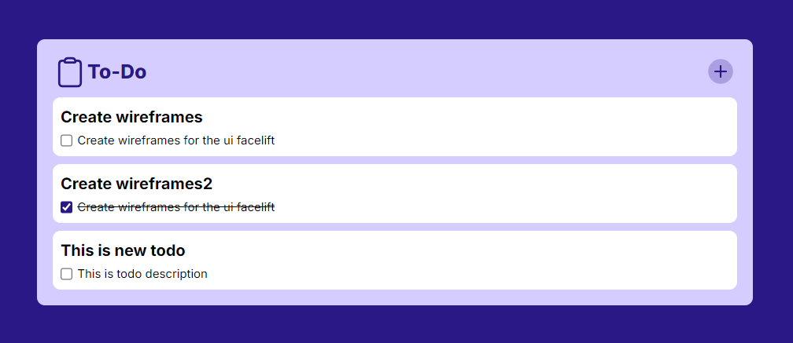

---

# Todo App

A simple Todo application built with Next.js, TypeScript, and Tailwind CSS.

# Screenshots




A simple Todo application built with Next.js, TypeScript, and Tailwind CSS. This app allows users to add, edit, and delete tasks to keep track of their daily activities.


## Tech Stack

- **Next.js**: A React framework for production that provides server-side rendering and static site generation.
- **TypeScript**: A statically typed superset of JavaScript.
- **Tailwind CSS**: A utility-first CSS framework for rapid UI development.

## Getting Started

### Prerequisites

Ensure you have the following installed on your machine:

- [Node.js](https://nodejs.org/en/) (v14 or later)
- npm (Node Package Manager) or [Yarn](https://yarnpkg.com/)

### Installation

1. Clone the repository:

   ```bash
   git clone https://github.com/your-username/todo-app.git
   cd todo-app
   ```

2. Install the dependencies:

   ```bash
   npm install
   # or
   yarn install
   ```

3. Run the development server:

   ```bash
   npm run dev
   # or
   yarn dev
   ```

4. Open your browser and go to [http://localhost:3000](http://localhost:3000) to see the app running.

## Project Structure

- `pages/`: Contains the Next.js pages.
- `components/`: Reusable React components.
- `styles/`: Tailwind CSS configuration and global styles.
- `assets/`: Static files such as images and icons.

## Available Scripts

- **`npm run dev`**: Runs the app in development mode.
- **`npm run build`**: Builds the app for production.
- **`npm run start`**: Runs the built app in production mode.
- **`npm run lint`**: Lints the code for potential errors.

## Deployment

You can deploy this app to various hosting platforms that support Next.js, such as:

- [Vercel](https://vercel.com/)
- [Netlify](https://www.netlify.com/)

To deploy on Vercel:

1. Push your code to a Git repository.
2. Go to [Vercel](https://vercel.com/) and import your repository.
3. Follow the steps in Vercel's deployment wizard to complete the deployment.

## Contributing

Contributions are welcome! If you'd like to contribute, please fork the repository and create a pull request with your changes.

## Acknowledgements

- [Next.js Documentation](https://nextjs.org/docs)
- [TypeScript Documentation](https://www.typescriptlang.org/docs/)
- [Tailwind CSS Documentation](https://tailwindcss.com/docs)
